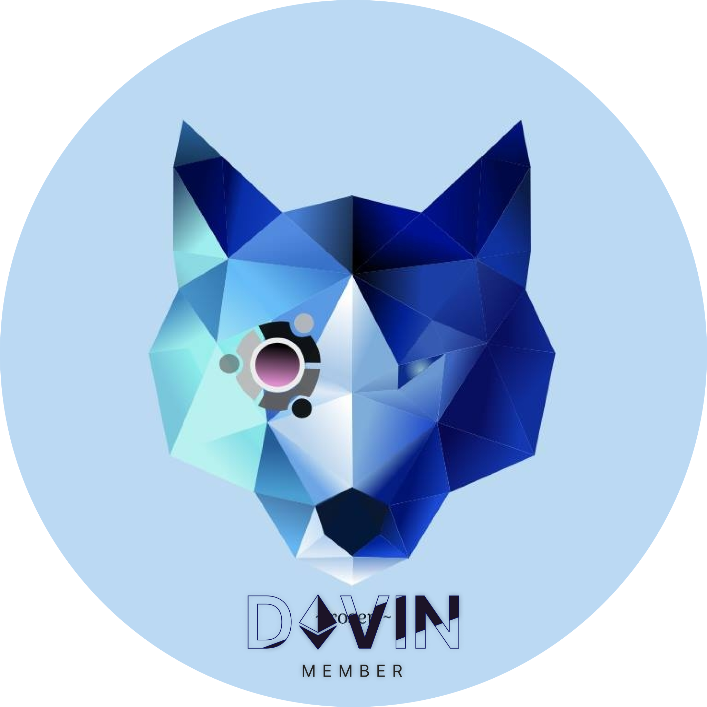

  
 

### About me :v:
- Name: Tran Huy Duc
- Email: tranhuyducseven@gmail.com    |   duc.tran_ares@hcmut.edu.vn
- School: Ho Chi Minh city University of Technology, Viet Nam
- Member at https://github.com/de-v-in  | https://1devin.vercel.app/
- Major: Website  
- Role: `Software developer`

### Skills :collision:
- Familiarity with RESTful APIs
- Techs: `NextJS` `Redux` `ExpressJS` `Substrate` (newbie)
- Languages: `Javascript`, `Typescript`, `Go`, `Rust`, `C++`, `SQL`
- Basic knowledge of DevOps: `Docker`, `docker-compose`, `CI/CD` (GitLab)
- Operating systems: Linux (Debian)
- My current research direction: `Rust`
- Text editor: `vscode`, `nvim` 

### Stats :triangular_flag_on_post:

